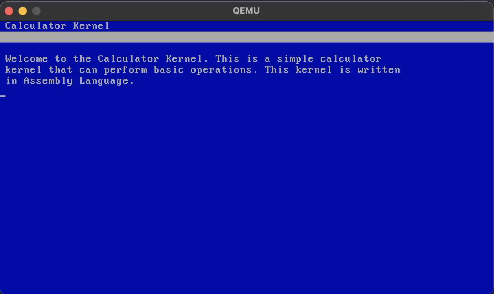

# CalcOS Kernel
Copyright &copy; Tijn Rodrigo - 2023 All Rights Reserved




<br>

# Project requirements
There are a few requirements for this project to work. Please make sure you have all of them for this project to work propertly.

    - QEMU Emulator (To emulate the project)
    - NASM (assembly language compiler)
    - GNU Make (For fast compling and testing)
    - dd (for making floppy/iso images)

<br>

# Build and run project

**<p style="color:red;">Makefile optimized for unix devices</p>**

Use 
```
make 
```
or 
```
make all
```

to build and emulate the program


